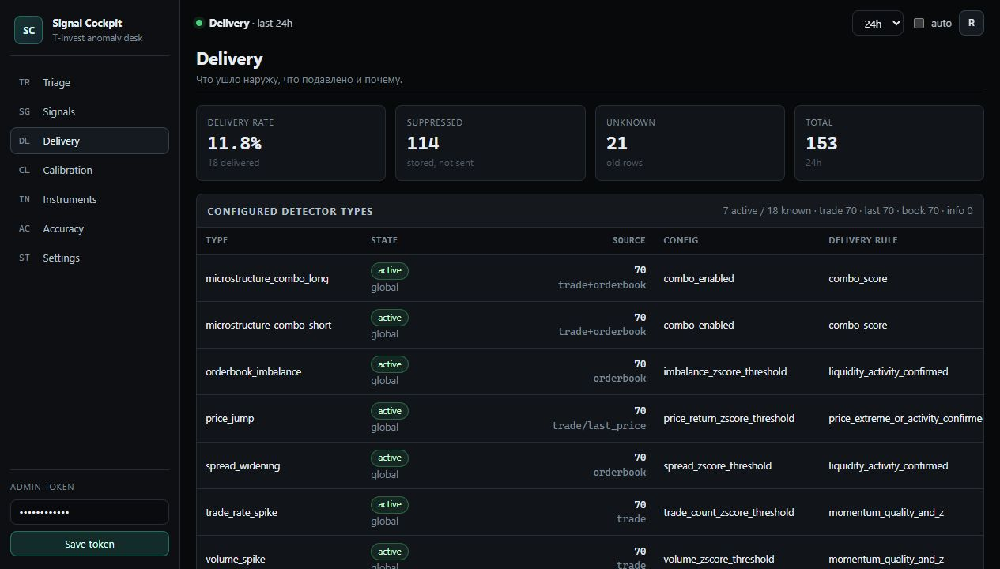
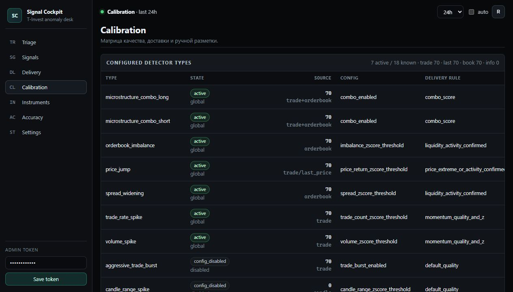

# Signal Cockpit

<section class="doc-hero">
  <p class="hero-kicker">Static v2 admin</p>
  <h1>Trading cockpit для triage сигналов</h1>
  <p>
    Signal Cockpit показывает не только то, что ушло в Telegram, но и всё, что detector сохранил
    в Postgres/Kafka: suppressed, unknown, delivered, причины фильтрации, качество и контекст по инструменту.
  </p>
  <div class="hero-actions">
    <a class="md-button md-button--primary" href="#screens">Смотреть экраны</a>
    <a class="md-button" href="#delivery-v2">Delivery V2</a>
    <a class="md-button" href="#api">Admin API</a>
  </div>
</section>

<div class="metric-strip">
  <div class="metric"><strong>Static v2</strong><span>без React/Vite и build pipeline</span></div>
  <div class="metric"><strong>Storage-first</strong><span>низкое качество не теряется</span></div>
  <div class="metric"><strong>Delivery-aware</strong><span>видны причины Telegram-фильтра</span></div>
  <div class="metric"><strong>Calibration</strong><span>type x quality x feedback</span></div>
</div>

Signal Cockpit — статическая админка для triage сигналов, delivery policy и калибровки порогов. HTML/CSS/JS лежат в `src/tinvest_signal_engine/static`, а данные берутся из `/admin/api/*`.

Админка не заменяет detector. Detector продолжает генерировать и сохранять все enriched-сигналы в Postgres/Kafka, а Cockpit показывает, что было доставлено в Telegram, что было подавлено и почему.

В таблицах и карточке сигнала Cockpit использует `payload.interpretation`: короткую human-readable строку и набор фактов. Поэтому `price_jump` показывает направление и процент изменения цены, `volume_spike` — оценочный оборот в деньгах, а orderbook-сигналы — bid/ask, spread и сторону перекоса без ручного чтения JSON.

## Manual intraday workflow

The cockpit is evolving from a raw signal triage screen into a manual intraday trading cockpit. The operator flow is:

1. Raw detector signals stay storage-first in Postgres/Kafka and remain visible even when delivery suppresses them.
2. The cockpit groups actionable signals into Points of Interest (POI): ticker, direction, price/volume/orderbook context, quality, delivery status, and the reason it deserves review.
3. The operator records a paper-trading or journal decision against the POI: watched, skipped, paper entry, paper exit, thesis, invalidation, and outcome.
4. Accuracy views compare POI and signal decisions with forward VWAP/price movement, feedback labels, and delivery status.
5. Delivery policy stays conservative: unproven POI types should start as `admin_only` or `digest` and only move to realtime after journal, feedback, and accuracy evidence supports promotion.

POI is not a promise that the system will trade automatically. It is the cockpit unit for human review, paper trading, and later calibration.

## Trading Radar MVP

The current POI implementation is read-time and conservative:

- `#/radar` is now the default admin route.
- `/admin/api/poi` builds Points of Interest from stored signal rows grouped by instrument and a short time window.
- `/admin/api/poi/{poi_id}` returns a POI detail view with scenario summary, drivers, nearby raw signals, source health, and Tbank links.
- `/admin/api/poi/delivery/simulation` classifies POIs into `realtime`, `digest`, or `admin_only` candidates without mutating payloads or sending Telegram.
- `/admin/api/poi/feedback` saves manual journal actions such as `watch`, `dismiss`, `paper_long`, `paper_short`, `missed`, `useful`, `noise`, and `unsure`.
- `#/journal` shows manual POI marks, paper PnL, win-rate, missed opportunities, and notes.
- `/admin/api/poi-accuracy` reads `var/accuracy/poi_accuracy.json` next to the signal accuracy file and returns a safe empty state when it is missing.

V1 POIs are not persisted as a separate entity. The journal stores the POI id and snapshot metadata, while raw detector signals remain the source of truth.

## Запуск

1. Задайте `ADMIN_API_TOKEN` в `.env`.
2. Запустите API:

```bash
docker compose up -d api
```

3. Откройте `http://localhost:38000/admin`.
4. Введите admin token. Токен хранится только в `localStorage` браузера и отправляется как `X-Admin-Token`.

Полезные runtime-настройки:

| Переменная | Назначение |
|---|---|
| `SIGNAL_DELIVERY_ENABLED` | Включает/выключает внешний delivery gate. |
| `SIGNAL_DELIVERY_MIN_QUALITY` | Базовый floor качества для delivery policy. |
| `SIGNAL_DELIVERY_MAX_PER_HOUR` | Глобальный cap Telegram/webhook-сигналов в час. |
| `SIGNAL_DELIVERY_INSTRUMENT_COOLDOWN_SECONDS` | Cooldown между delivered-сигналами по одному инструменту. |
| `SIGNAL_DELIVERY_TYPE_RULES_JSON` | Optional per-type overrides in JSON: `admin_only`, `channel=digest`, or explicit realtime promotion. |

## Delivery V2

Текущая policy пишет все сигналы в storage, но наружу пропускает только сильные или подтверждённые события:

| Тип | Delivery logic |
|---|---|
| `microstructure_combo_long/short` | `score >= 6`. |
| `volume_spike`, `trade_rate_spike` | `quality >= 80` и `abs_z >= 6`, либо extreme `abs_z >= 10`. |
| `price_jump` | `quality >= 90` и `abs_z >= 8`, либо рядом с recent trade activity. |
| `spread_widening`, `orderbook_imbalance` | Только рядом с volume/trade/combo activity. |
| `trading_status_changed`, `market_access_changed` | Всегда candidate, но с cooldown. |

Rate-limit и instrument cooldown проверяются не только в памяти процесса, но и по Postgres history. Поэтому рестарт `detector` не должен заново открыть окно для спама.

## Разделы

| Раздел | Route | Для чего |
|---|---|---|
| Triage | `#/triage` | Очередь внимания: важные suppressed/delivered сигналы, funnel, причины подавления, hot tickers. |
| Signals | `#/signals` | Плотная таблица всех сигналов с фильтрами по delivery, type, ticker, quality, feedback. |
| Delivery | `#/delivery` | Сводка delivered/suppressed/unknown, причины подавления и per-type delivery rate. |
| Calibration | `#/calibration` | Матрица `signal_type x quality tier x feedback/delivery` для настройки порогов. |
| Instruments | `#/instruments` | Полный configured universe из `conf/instruments.yaml` плюс активность по каждому тикеру. |
| Accuracy | `#/accuracy` | JSON-метрики accuracy, если подготовлен `SIGNAL_ACCURACY_JSON_PATH`. |
| Settings | `#/settings` | Read-only runtime config без секретов. |

Quick feedback controls are available directly in `Triage` and `Signals`: `Useful`, `Noise`, and `Unsure` save `/admin/api/feedback` without opening the signal drawer. The `Signals` feedback filter supports `unlabeled` for rows that still need review.

For manual POI review, treat `Triage` as the queue, `Signals` as the audit trail, `Delivery` as the suppression explanation, `Calibration` as the threshold review surface, and `Accuracy` as the evidence layer before promoting a POI family to wider delivery.

<a id="screens"></a>

## Примеры экранов

<div class="screenshot-grid">
  <figure class="screenshot-card">
    
    <figcaption><strong>Triage.</strong> Delivery funnel, очередь внимания, причины suppressed и hot tickers на первом экране.</figcaption>
  </figure>
  <figure class="screenshot-card">
    
    <figcaption><strong>Signals.</strong> Плотная таблица всех сохранённых сигналов с фильтрами по status, type, quality, ticker и feedback.</figcaption>
  </figure>
  <figure class="screenshot-card">
    
    <figcaption><strong>Signal detail.</strong> Summary, delivery decision, quality factors, payload и контекст для ручной разметки.</figcaption>
  </figure>
  <figure class="screenshot-card">
    
    <figcaption><strong>Delivery.</strong> Быстрая проверка rate-limit, cooldown, недостаточного качества и отсутствия подтверждающего контекста.</figcaption>
  </figure>
  <figure class="screenshot-card">
    
    <figcaption><strong>Calibration.</strong> Матрица помогает увидеть, какие типы шумят, какие недопущены фильтром и где нужна feedback-разметка.</figcaption>
  </figure>
  <figure class="screenshot-card">
    
    <figcaption><strong>Instruments.</strong> Полный universe из `conf/instruments.yaml`; тикеры с нулём сигналов тоже остаются видимыми.</figcaption>
  </figure>
</div>

<p class="docs-note">
  Старые записи без delivery metadata отображаются как <code>delivery_status=unknown</code>, поэтому исторические данные не ломают таблицы и графики.
</p>

## API

Основные endpoints:

| Endpoint | Назначение |
|---|---|
| `/admin/api/signals` | Таблица сигналов с фильтрами `delivery_status`, `quality_min`, `quality_max`, `feedback`, `severity`, `instrument_id`, `signal_type`. |
| `/admin/api/signal/{signal_id}` | Детальная карточка сигнала. |
| `/admin/api/delivery/overview` | Delivery totals, per-type/per-ticker rates. |
| `/admin/api/delivery/reasons` | Причины suppressed/unknown/delivered. |
| `/admin/api/calibration` | Матрица калибровки по type/quality/feedback. |
| `/admin/api/instruments` | Configured universe + activity stats. |
| `/admin/api/settings` | Read-only runtime settings для Cockpit. |

### POI Routes and API

| Surface | Purpose |
|---|---|
| `#/radar` | Default Trading Radar: POI queue, tickers in play, bias/score/levels, POI delivery dry-run, quick journal actions. |
| `#/poi?id=...` | POI detail: scenario, source health, drivers, nearby raw signals, journal form, and raw POI JSON. |
| `#/journal` | Manual POI actions and paper-trading results. |
| `/admin/api/poi` | Read-time POI queue built from stored signals. |
| `/admin/api/poi/{poi_id}` | POI detail contract with drivers and nearby raw signals. |
| `/admin/api/poi/feedback` | Save manual POI journal/paper-trading action. |
| `/admin/api/poi/delivery/simulation` | Dry-run POI delivery policy; no Telegram side effects. |
| `/admin/api/journal` | Manual POI journal with paper PnL and win-rate summary. |
| `/admin/api/poi-accuracy` | POI accuracy JSON summary with safe missing-file state. |
