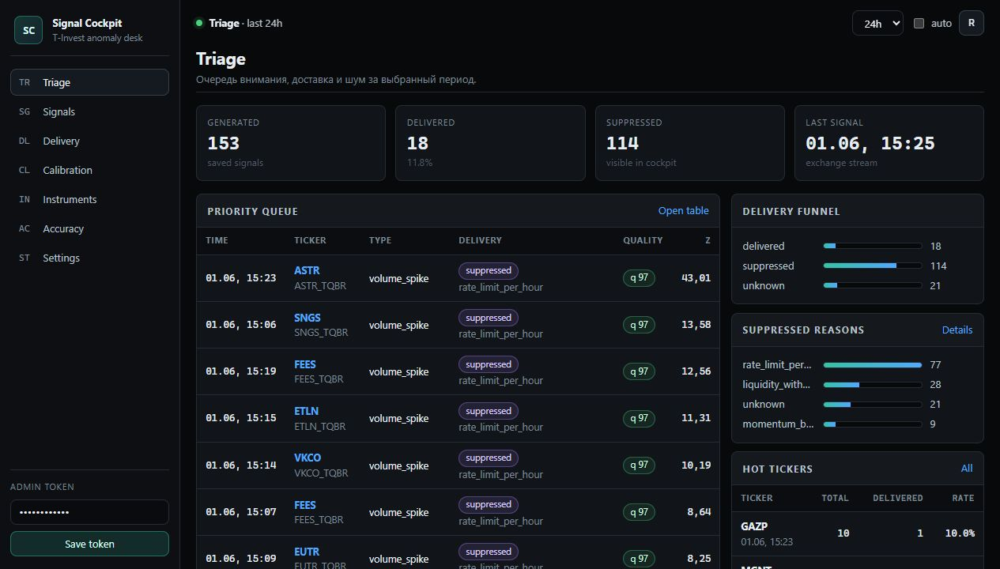
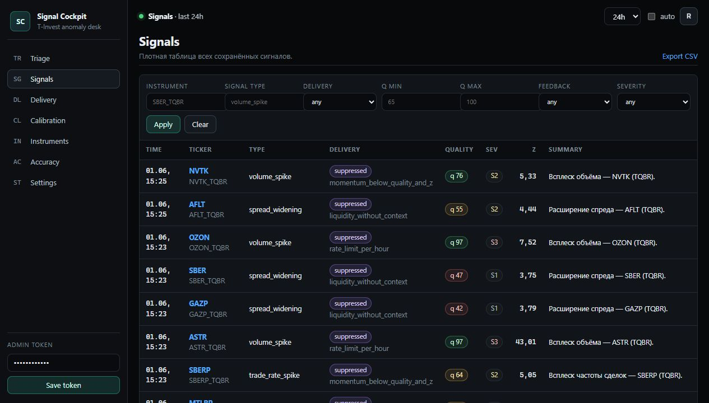
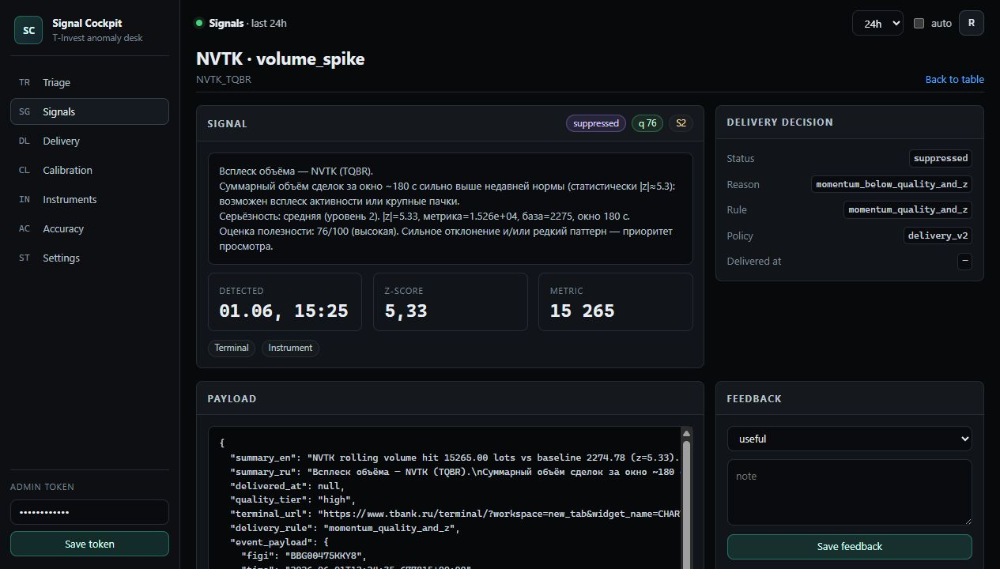
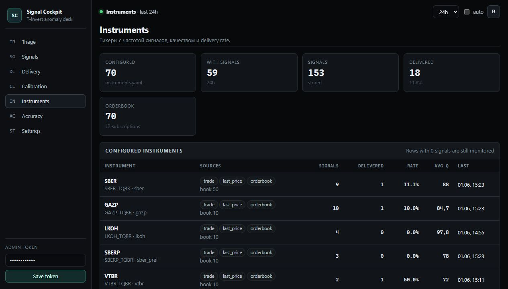

# Signal Cockpit

Signal Cockpit — статическая админка для triage сигналов, delivery policy и калибровки порогов. Она живёт без frontend build step: HTML/CSS/JS лежат в `src/tinvest_signal_engine/static`, а данные берутся из `/admin/api/*`.

Админка не заменяет detector. Detector продолжает генерировать и сохранять все enriched-сигналы в Postgres/Kafka, а Cockpit показывает, что было доставлено в Telegram, что было подавлено и почему.

## Запуск

1. Задайте `ADMIN_API_TOKEN` в `.env`.
2. Запустите API:

```bash
docker compose up -d api
```

3. Откройте `http://localhost:38000/admin`.
4. Введите admin token. Токен хранится только в `localStorage` браузера и отправляется как `X-Admin-Token`.

Полезные runtime-настройки:

| Переменная | Назначение |
|---|---|
| `SIGNAL_DELIVERY_ENABLED` | Включает/выключает внешний delivery gate. |
| `SIGNAL_DELIVERY_MIN_QUALITY` | Базовый floor качества для delivery policy. |
| `SIGNAL_DELIVERY_MAX_PER_HOUR` | Глобальный cap Telegram/webhook-сигналов в час. |
| `SIGNAL_DELIVERY_INSTRUMENT_COOLDOWN_SECONDS` | Cooldown между delivered-сигналами по одному инструменту. |
| `SIGNAL_DELIVERY_TYPE_RULES_JSON` | Optional per-type overrides в JSON. |

## Delivery V2

Текущая policy пишет все сигналы в storage, но наружу пропускает только сильные или подтверждённые события:

| Тип | Delivery logic |
|---|---|
| `microstructure_combo_long/short` | `score >= 6`. |
| `volume_spike`, `trade_rate_spike` | `quality >= 80` и `abs_z >= 6`, либо extreme `abs_z >= 10`. |
| `price_jump` | `quality >= 90` и `abs_z >= 8`, либо рядом с recent trade activity. |
| `spread_widening`, `orderbook_imbalance` | Только рядом с volume/trade/combo activity. |
| `trading_status_changed`, `market_access_changed` | Всегда candidate, но с cooldown. |

Rate-limit и instrument cooldown проверяются не только в памяти процесса, но и по Postgres history. Поэтому рестарт `detector` не должен заново открыть окно для спама.

## Разделы

| Раздел | Route | Для чего |
|---|---|---|
| Triage | `#/triage` | Очередь внимания: важные suppressed/delivered сигналы, funnel, причины подавления, hot tickers. |
| Signals | `#/signals` | Плотная таблица всех сигналов с фильтрами по delivery, type, ticker, quality, feedback. |
| Delivery | `#/delivery` | Сводка delivered/suppressed/unknown, причины подавления и per-type delivery rate. |
| Calibration | `#/calibration` | Матрица `signal_type x quality tier x feedback/delivery` для настройки порогов. |
| Instruments | `#/instruments` | Полный configured universe из `conf/instruments.yaml` плюс активность по каждому тикеру. |
| Accuracy | `#/accuracy` | JSON-метрики accuracy, если подготовлен `SIGNAL_ACCURACY_JSON_PATH`. |
| Settings | `#/settings` | Read-only runtime config без секретов. |

## Примеры Экранов

### Triage

Главный экран для быстрого разбора: сверху delivery funnel и последние значения, ниже очередь внимания и причины suppressed.



### Signals

Плотная таблица всех сохранённых сигналов. Важно: suppressed-события тоже видны, потому что storage больше не зависит от Telegram delivery.



### Signal Detail

Карточка сигнала показывает summary, delivery decision, quality factors, payload и контекст для ручной разметки.



### Delivery

Экран для проверки, почему сигналы не доходят в Telegram: rate-limit, cooldown, недостаточное качество или отсутствие контекста.


### Calibration

Матрица калибровки помогает увидеть, какие типы шумят, какие недопущены фильтром и где нужна ручная разметка feedback.


### Instruments

Полный universe инструментов берётся из `conf/instruments.yaml`. Строки с `0` сигналов всё равно отображаются, чтобы было видно, что тикер подключён, но пока не сработал.



## API

Основные endpoints:

| Endpoint | Назначение |
|---|---|
| `/admin/api/signals` | Таблица сигналов с фильтрами `delivery_status`, `quality_min`, `quality_max`, `feedback`, `severity`, `instrument_id`, `signal_type`. |
| `/admin/api/signal/{signal_id}` | Детальная карточка сигнала. |
| `/admin/api/delivery/overview` | Delivery totals, per-type/per-ticker rates. |
| `/admin/api/delivery/reasons` | Причины suppressed/unknown/delivered. |
| `/admin/api/calibration` | Матрица калибровки по type/quality/feedback. |
| `/admin/api/instruments` | Configured universe + activity stats. |
| `/admin/api/settings` | Read-only runtime settings для Cockpit. |

Старые записи без delivery metadata отображаются как `delivery_status=unknown`.
