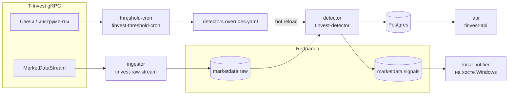

# Архитектура и ответственность компонентов

Этот документ описывает **как движутся данные**.

## Общая схема

1. **Инжестор** подписывается на поток рынка, нормализует сообщения в JSON и пишет в топик сырых событий.
2. **Детектор** читает сырой топик, для каждого события обновляет скользящее состояние по инструменту и при срабатывании правил формирует **сигнал**.
3. Каждый сигнал: запись в **Postgres**, публикация в топик **сигналов**, опционально **webhook** и **Telegram**.
4. **API** только читает Postgres и отдаёт HTTP JSON.
5. **threshold-cron** по расписанию тянет историю свечей, пересчитывает пороги и перезаписывает YAML overrides; детектор подхватывает файл без рестарта.
6. **Локальный нотификатор** (на Windows-хосте) читает топик сигналов с `localhost` и показывает всплывающие уведомления.

## Docker Compose: сервисы

Файл `docker-compose.yml` задаёт связку процессов. Ниже — роль каждого сервиса.

| Сервис | Команда | Назначение |
|--------|---------|------------|
| `redpanda` | образ Redpanda | Kafka-совместимый брокер внутри сети compose. |
| `redpanda-init` | одноразовый `rpk` | Создаёт топики `marketdata.raw`, `marketdata.signals`, задаёт retention ~100 МБ. |
| `redpanda-console` | Console | Веб-UI для просмотра топиков и сообщений. |
| `postgres` | Postgres 16 | Таблица сигналов (DDL в `sql/postgres/init/`). |
| `ingestor` | `tinvest-raw-stream` | Поток T-Invest → Kafka raw. |
| `detector` | `tinvest-detector` | Kafka raw → логика детектора → Postgres + Kafka signals + алерты. |
| `threshold-cron` | `tinvest-threshold-cron` | Расчёт порогов → `conf/detectors.overrides.yaml` (том `./conf` **не** read-only). |
| `api` | `tinvest-api` | FastAPI, порт наружу `HOST_API_PORT` (по умолчанию 38000→8000). |

Переменные окружения задаются через `.env`; конфиги монтируются из `./conf`.

## Пакет `tinvest_signal_engine`: модули и ответственность

### Конфигурация (`config.py`)

- **`RuntimeSettings`** — все параметры из переменных окружения: брокер Kafka (адреса для контейнера и для хоста), топики, Postgres, API, Telegram/webhook, пути к YAML, интервалы перезагрузки конфигов и пересчёта порогов.
- **`InstrumentSubscriptionConfig`** / **`load_instrument_configs`** — разбор `conf/instruments.yaml`: тикер, класс, подписки (сделки, last price, стакан, свечи и т.д.).
- **`DetectorSettings`** / **`load_detector_config`** — базовые пороги из `conf/detectors.yaml` + слияние с `per_instrument` и файлом overrides.

### Модели событий (`models.py`)

- **`NormalizedEvent`** — единый формат сообщения после инжестора (тип события, идентификаторы инструмента, время источника, сырой `payload` для детектора).
- **`TriggerSignal`** — результат детектора: тип сигнала, метрики, z-score, текст `summary`, дополнительный `payload`.

### Сериализация (`serialization.py`)

Преобразование времени в UTC, распаковка котировок в `float`, приведение protobuf/dataclass структур SDK к plain dict/list для JSON.

### Реестр инструментов (`instruments.py`)

По каждой строке из YAML вызывается `GetInstrumentBy`; строится **`InstrumentRegistry`** для сопоставления `instrument_id` / FIGI / UID с тикером и метаданными в нормализованном событии.

### Ядро детектора (`detector_core.py`)

Класс **`SignalDetector`** держит **`InstrumentState`** на инструмент (очереди сделок, цен, истории метрик). По типу события:

| `event_type` | Что учитывается | Типичные сигналы |
|--------------|-----------------|------------------|
| `trade` | объём, число сделок, окно цен | `volume_spike`, `trade_rate_spike`, `price_jump`, combo |
| `last_price` | движение цены в окне | `price_jump` |
| `orderbook` | спред bps, дисбаланс верхних уровней | `spread_widening`, `orderbook_imbalance`, combo |
| `trading_status` | смена статуса | `trading_status_changed` |

Для большинства метрик используется **скользящая база** (последние `baseline_points` значений) и **z-score** относительно среднего и стандартного отклонения; отдельно задаются **cooldown** между алертами одного типа и **минимальное число точек** до первых срабатываний. Опционально **`combo_*`** объединяет несколько свежих условий в `microstructure_combo_long` / `short`.

**Подробно про торговый смысл каждого сигнала, формулы и параметры YAML** — на странице **[Детекторы и паттерны](detectors.md)**.

### Приёмники (`sinks.py`)

- **`PostgresSignalStore`** — вставка сигналов и выборки для API (`fetch_recent`, `fetch_summary`).
- **`WebhookAlertSink`** / **`TelegramAlertSink`** — доставка алертов из детектора.

### Сервисы (точки входа CLI)

| Скрипт | Модуль | Роль |
|--------|--------|------|
| `tinvest-raw-stream` | `services/ingestor.py` | Цикл: клиент T-Invest → нормализация → Kafka producer. При изменении `instruments.yaml` переподключается к стриму. |
| `tinvest-detector` | `services/detector_service.py` | Consumer raw → `SignalDetector.process` → Postgres + producer signals + webhook/Telegram. Периодически перечитывает YAML детектора. |
| `tinvest-api` | `services/api.py` | FastAPI, при старте подключение к Postgres с retry. |
| `tinvest-local-notifier` | `services/local_notifier.py` | Consumer signals с **`kafka_host_bootstrap_servers`** (хост видит `localhost:39092`). |
| `tinvest-threshold-cron` | `services/threshold_cron.py` | Цикл: свечи по инструментам → среднее почасовое \|open-close\| в bps → запись overrides. |

### Уведомления на рабочем столе (`desktop_notifications.py`)

Реализация только для **Windows** через PowerShell и иконку в трее; на других ОС используется заглушка с логированием.

### Логирование (`logging_utils.py`)

Общий `basicConfig` для всех сервисов по уровню из `LOG_LEVEL`.

## Топики Kafka

| Топик | Содержимое | Ключ сообщения |
|-------|------------|----------------|
| `marketdata.raw` | `NormalizedEvent.to_dict()` | `instrument_id` |
| `marketdata.signals` | `TriggerSignal.to_dict()` | `instrument_id` |

Имена топиков переопределяются переменными `KAFKA_RAW_TOPIC`, `KAFKA_SIGNAL_TOPIC`.

## Конфигурационные файлы

| Файл | Кто читает | Назначение |
|------|------------|------------|
| `conf/instruments.yaml` | ingestor | Список инструментов и подписок на поток. |
| `conf/detectors.yaml` | detector | Глобальные пороги и опционально ручные `per_instrument`. |
| `conf/detectors.overrides.yaml` | detector, пишет threshold-cron | Автоматические переопределения (часто `price_move_absolute_threshold_bps`). |
