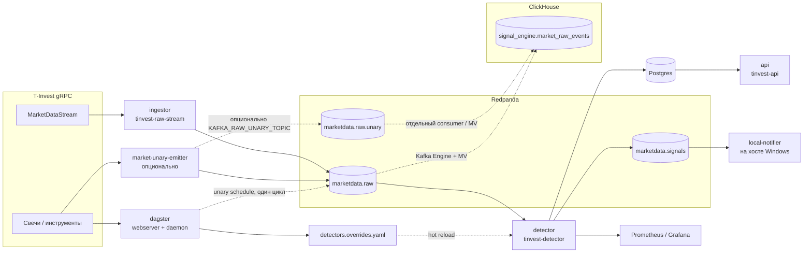

# Архитектура и ответственность компонентов

Этот документ описывает **как движутся данные**.

## Общая схема

```mermaid
flowchart LR
  subgraph tinvest [T-Invest gRPC]
    MDS[MarketDataStream]
    REST[Свечи / инструменты]
  end
  subgraph broker [Redpanda]
    RAW[(marketdata.raw)]
    RAWU[(marketdata.raw.unary)]
    SIG[(marketdata.signals)]
  end
  subgraph olap [ClickHouse]
    CH[(signal_engine.market_raw_events)]
  end
  ING[ingestor<br/>tinvest-raw-stream]
  UNE[market-unary-emitter<br/>опционально]
  DET[detector<br/>tinvest-detector]
  PG[(Postgres)]
  API[api<br/>tinvest-api]
  DS[dagster<br/>webserver + daemon]
  WIN[local-notifier<br/>на хосте Windows]
  PROM[Prometheus / Grafana]

  MDS --> ING
  ING --> RAW
  REST --> UNE
  REST --> DS
  UNE --> RAW
  DS -.->|unary schedule, один цикл| RAW
  UNE -.->|опционально KAFKA_RAW_UNARY_TOPIC| RAWU
  RAW --> DET
  RAWU -.->|отдельный consumer / MV| CH
  RAW -.->|Kafka Engine + MV| CH
  DET --> PG
  DET --> SIG
  DET --> PROM
  SIG --> WIN
  DS --> CONF[detectors.overrides.yaml]
  CONF -.->|hot reload| DET
  PG --> API
```

1. **Инжестор** подписывается на поток рынка, нормализует сообщения в JSON и пишет в топик сырых событий.
2. Опционально **market-unary-emitter** (`docker compose --profile unary`) вызывает unary gRPC (`GetMarketValues`, `GetTechAnalysis`) и публикует `NormalizedEvent` в Kafka; альтернатива — **расписание Dagster** `unary_kafka_poll_once_job` (один цикл за run, без отдельного контейнера emitter). По умолчанию (`KAFKA_RAW_UNARY_TOPIC` пуст) — в тот же топик, что и инжестор (`marketdata.raw`), тогда детектор видит `market_values` / `tech_analysis` и может прикладывать снимок к сигналам (`attach_unary_context_to_signals` в `detectors.yaml`). Отдельный топик **`marketdata.raw.unary`** удобен для OLAP без смешения со стримом; в этом режиме детектор unary-события **не** читает (контекст в сигнале будет пустым, пока не добавят второй consumer).
3. **Детектор** читает основной сырой топик, для каждого события обновляет скользящее состояние по инструменту и при срабатывании правил формирует **сигнал**.
4. **ClickHouse** независимо потребляет топик `marketdata.raw` через `Kafka` + materialized view и складывает строки в `MergeTree` для OLAP и бэктеста (Postgres остаётся только для алертов/API). Топик `marketdata.raw.unary` подключается отдельной таблицей Kafka Engine при необходимости (см. DDL в `sql/clickhouse/init/`).
5. Каждый сигнал: запись в **Postgres**, публикация в топик **сигналов**, опционально **webhook** и **Telegram**.
6. **API** читает Postgres и отдаёт HTTP JSON; **`/ready`** проверяет ping к Postgres (readiness).
7. **Dagster** (`dagster-webserver` + `dagster-daemon`, см. `orchestration_defs.py`) по расписанию запускает пересчёт порогов из свечей (`run_recalc_once` → `detectors.overrides.yaml`) и при необходимости **одиночный** цикл unary → Kafka (`MARKET_UNARY_SINGLE_SHOT`); детектор подхватывает overrides без рестарта. Старый сервис **`threshold-cron`** оставлен только под профилем `legacy-threshold-cron`.
8. **Локальный нотификатор** (на Windows-хосте) читает топик сигналов с `localhost` и показывает всплывающие уведомления.
9. **Prometheus / Grafana** (compose) собирают метрики Redpanda и детектора (`detector_*`); при профиле `unary` — метрики `market_unary_*` на порту `MARKET_UNARY_METRICS_LISTEN_PORT` (см. `observability/prometheus.yml`, закомментированный job-пример).

## Docker Compose: сервисы

Файл `docker-compose.yml` задаёт связку процессов. Ниже — роль каждого сервиса.

| Сервис | Команда | Назначение |
|--------|---------|------------|
| `redpanda` | образ Redpanda | Kafka-совместимый брокер внутри сети compose. |
| `redpanda-init` | одноразовый `rpk` | Создаёт топики `marketdata.raw`, `marketdata.raw.unary`, `marketdata.signals`, задаёт retention ~100 МБ. |
| `redpanda-console` | Console | Веб-UI для просмотра топиков и сообщений. |
| `clickhouse` + `clickhouse-init` | ClickHouse 24.x | Архив сырого потока: `Kafka` engine + MV → `MergeTree` (`sql/clickhouse/init/`). |
| `prometheus` | Prometheus | Скрап метрик Redpanda (`:9644`) и детектора (`:9108`). |
| `grafana` | Grafana | Дашборды; datasource Prometheus из `observability/grafana/provisioning/`. |
| `postgres` | Postgres 16 | Таблица сигналов (DDL в `sql/postgres/init/`). |
| `ingestor` | `tinvest-raw-stream` | Поток T-Invest → Kafka raw. |
| `detector` | `tinvest-detector` | Kafka raw → логика детектора → Postgres + Kafka signals + алерты. |
| `dagster-webserver` | `dagster-webserver -m tinvest_signal_engine.orchestration_defs` | UI расписаний и ручной запуск jobs; `HOST_DAGSTER_PORT` (по умолчанию 30300→3000). |
| `dagster-daemon` | `dagster-daemon run -m …` | Выполнение schedules (пороги, unary single-shot); общий том `dagster_home` с webserver. |
| `threshold-cron` | `tinvest-threshold-cron` | Профиль **`legacy-threshold-cron`**: бесконечный цикл вместо Dagster. |
| `api` | `tinvest-api` | FastAPI, порт наружу `HOST_API_PORT` (по умолчанию 38000→8000); ждёт успешный `clickhouse-init`. |
| `market-unary-emitter` | `tinvest-market-unary-emitter` | Профиль `unary`: unary gRPC → Kafka (`KAFKA_RAW_UNARY_TOPIC`), метрики Prometheus. |

Переменные окружения задаются через `.env`; конфиги монтируются из `./conf`.

## Пакет `tinvest_signal_engine`: модули и ответственность

### Конфигурация (`config.py`)

- **`RuntimeSettings`** — все параметры из переменных окружения: брокер Kafka (адреса для контейнера и для хоста), топики, Postgres, API, Telegram/webhook, пути к YAML, интервалы перезагрузки конфигов и пересчёта порогов.
- **`InstrumentSubscriptionConfig`** / **`load_instrument_configs`** — разбор `conf/instruments.yaml`: тикер, класс, подписки (сделки, last price, стакан, свечи и т.д.).
- **`DetectorSettings`** / **`load_detector_config`** — базовые пороги из `conf/detectors.yaml` + слияние с `per_instrument` и файлом overrides.

### Модели событий (`models.py`)

- **`NormalizedEvent`** — единый формат сообщения после инжестора (тип события, идентификаторы инструмента, время источника, сырой `payload` для детектора).
- **`TriggerSignal`** — результат детектора: тип сигнала, метрики, z-score, текст `summary`, дополнительный `payload`.

### Сериализация (`serialization.py`)

Преобразование времени в UTC, распаковка котировок в `float`, приведение protobuf/dataclass структур SDK к plain dict/list для JSON.

### Реестр инструментов (`instruments.py`)

По каждой строке из YAML вызывается `GetInstrumentBy`; строится **`InstrumentRegistry`** для сопоставления `instrument_id` / FIGI / UID с тикером и метаданными в нормализованном событии.

### Ядро детектора (`detector_core.py`)

Класс **`SignalDetector`** держит **`InstrumentState`** на инструмент (очереди сделок, цен, истории метрик). По типу события:

| `event_type` | Что учитывается | Типичные сигналы |
|--------------|-----------------|------------------|
| `trade` | объём, число сделок, окно цен | `volume_spike`, `trade_rate_spike`, `price_jump`, combo |
| `last_price` | движение цены в окне | `price_jump` |
| `orderbook` | спред bps, дисбаланс верхних уровней, снапшоты L3 | `spread_widening`, `orderbook_imbalance`, `orderbook_spoofing_*`, combo |
| `trading_status` | смена статуса | `trading_status_changed` |
| `open_interest` | открытый интерес (фьючерсы) | `open_interest_spike` (если порог > 0) |
| `candle` | закрытая свеча | `candle_range_spike` (если порог > 0) |
| `market_values`, `tech_analysis` | unary-снимки (эмиттер или тот же топик) | новых сигналов не дают; при `attach_unary_context_to_signals` последний снимок попадает в `payload.unary_context` итогового сигнала |

Для большинства метрик используется **скользящая база** (последние `baseline_points` значений) и **z-score** относительно среднего и стандартного отклонения; отдельно задаются **cooldown** между алертами одного типа и **минимальное число точек** до первых срабатываний. Опционально **`combo_*`** объединяет несколько свежих условий в `microstructure_combo_long` / `short`.

**Подробно про торговый смысл каждого сигнала, формулы и параметры YAML** — на странице **[Детекторы и паттерны](detectors.md)**.

### Приёмники (`sinks.py`)

- **`PostgresSignalStore`** — вставка сигналов и выборки для API (`fetch_recent`, `fetch_summary`).
- **`WebhookAlertSink`** / **`TelegramAlertSink`** — доставка алертов из детектора.

### Сервисы (точки входа CLI)

| Скрипт | Модуль | Роль |
|--------|--------|------|
| `tinvest-raw-stream` | `services/ingestor.py` | Цикл: клиент T-Invest → нормализация → Kafka producer. При изменении `instruments.yaml` переподключается к стриму. |
| `tinvest-detector` | `services/detector_service.py` | Consumer raw → `SignalDetector.process` → Postgres + producer signals + webhook/Telegram. Периодически перечитывает YAML детектора. |
| `tinvest-api` | `services/api.py` | FastAPI, при старте подключение к Postgres с retry. |
| `tinvest-local-notifier` | `services/local_notifier.py` | Consumer signals с **`kafka_host_bootstrap_servers`** (хост видит `localhost:39092`). |
| `tinvest-threshold-cron` | `services/threshold_cron.py` | Бесконечный цикл (legacy) или однократный `run_recalc_once` из Dagster: свечи → bps → overrides. |
| `tinvest-market-unary-emitter` | `services/market_unary_emitter.py` | Цикл unary → Kafka; backoff при ошибках API; метрики `market_unary_*`. |

### Уведомления на рабочем столе (`desktop_notifications.py`)

Реализация только для **Windows** через PowerShell и иконку в трее; на других ОС используется заглушка с логированием.

### Логирование (`logging_utils.py`)

Общий `basicConfig` для всех сервисов по уровню из `LOG_LEVEL`.

## Топики Kafka

| Топик | Содержимое | Ключ сообщения |
|-------|------------|----------------|
| `marketdata.raw` | `NormalizedEvent.to_dict()` | `instrument_id` |
| `marketdata.raw.unary` | те же поля (unary poll) | `instrument_id` |
| `marketdata.signals` | `TriggerSignal.to_dict()` | `instrument_id` |

Имена топиков: `KAFKA_RAW_TOPIC`, `KAFKA_SIGNAL_TOPIC`, опционально **`KAFKA_RAW_UNARY_TOPIC`** (пусто — эмиттер пишет в основной raw).

## Data lineage (нормализованное событие → OLAP)

Поля `NormalizedEvent` после инжестора (ключи JSON в Kafka):

| Поле | Происхождение | Примечание |
|------|----------------|------------|
| `event_id` | Инжестор (`uuid4`) | Уникален на каждое сообщение. |
| `event_type` | Поле protobuf стрима (`trade`, `orderbook`, …) | Нормализованное имя ветки payload. |
| `instrument_id`, `ticker`, `class_code`, `alias` | `instruments.yaml` + `GetInstrumentBy` | `instrument_id` = `TICKER_CLASS` из конфига. |
| `figi`, `uid` | Ответ T-Invest по инструменту | Для трассировки к первичному API. |
| `source_time` | Поля времени в payload (`time`, `last_trade_ts`, …) | UTC; при отсутствии — `received_at`. |
| `received_at` | Часы инжестора | UTC. |
| `payload` | Сырой plain-dict из SDK | Без потери полей для детектора и ClickHouse (`payload_json`). |

В ClickHouse таблица `signal_engine.market_raw_events` хранит те же семантики плюс `payload_json` как строку JSON из `JSONExtractRaw`.

### Feature store (инкрементальные витрины)

По `market_raw_events` для сделок (`event_type = 'trade'`) строятся **materialized views** в `SummingMergeTree` (агрегация на insert, без полного скана истории при каждом запросе — см. `query-mv-incremental` в ClickHouse best practices):

| Таблица | Окно | Поля | Представление |
|---------|------|------|----------------|
| `signal_engine.features_trade_bar_1m` | 1 мин | `sum_pv`, `sum_qty`, `n_trades` | `vw_trade_bar_1m_vwap` → VWAP, trades/s |
| `signal_engine.features_trade_bar_5m` | 5 мин | то же | `vw_trade_bar_5m_vwap` |
| `signal_engine.features_trade_bar_15m` | 15 мин | то же | `vw_trade_bar_15m_vwap` |

DDL: `sql/clickhouse/init/002_feature_store_bars.sql`. Для тяжёлой оффлайн-оценки на слабом ПК экспортируйте Parquet/CSV и используйте **DuckDB** (`scripts/duckdb_feature_smoke.py`).

## Конфигурационные файлы

| Файл | Кто читает | Назначение |
|------|------------|------------|
| `conf/instruments.yaml` | ingestor | Список инструментов и подписок на поток. |
| `conf/detectors.yaml` | detector | Глобальные пороги и опционально ручные `per_instrument`. |
| `conf/detectors.overrides.yaml` | detector, пишет Dagster job / legacy threshold-cron | Автоматические переопределения (часто `price_move_absolute_threshold_bps`). |
